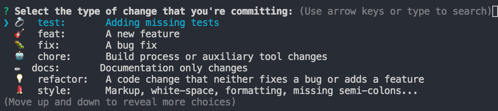
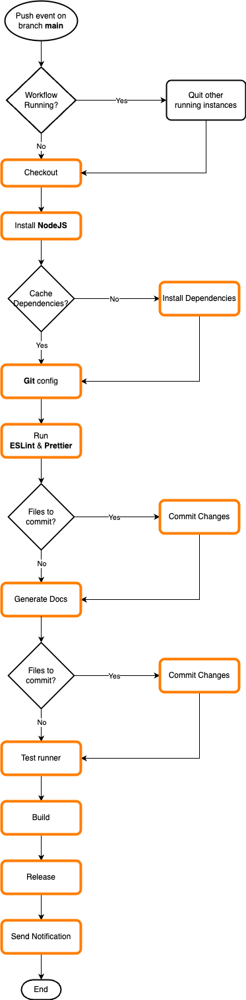

# Contents

- [Scripts](#scripts)
- [Creating a new branch](#creating-a-new-branch)
- [Git Hooks](#git-hooks)
- [Commit](#commit)
	- [How to commit](#how-to-commit)
- [Push](#push)
- [Release process](#release-process)
- [Install locally on host projects](#install-locally-on-host-projects)

# Contributing

## Scripts

- `npm start`

  Launches `Storybook` on port `6006`

- `npm run build`

  Compiles the code with `tsc` and saves the output into `/dist`

- `npm run test`

  Launches `Storybook` test suite, based on [`test-runner`](https://storybook.js.org/docs/writing-tests/test-runner)

- `npm run test:coverage`

  Launches `Storybook` test suite in coverage mode and saves the output into `/coverage`

- `npm run test:report`

  Running this command after `npm run test:coverage` generates an HTML report of the coverage into `/coverage/storybook/lcov-report`

## Creating a new branch

### From GitHub UI

Open the details of an issue assigned to you, and use the **Create new branch** link.
Follow the instructions and before creation choose the option `Checkout locally`.

Copy the git commands into your terminal:
```
git fetch
git checkout <new-branch-name>
```

### Manually

To create a new feature branch, start always from the latest status of branch `master`:

```
git checkout master
git pull
```

Then create locally a branch:

```git checkout -b "<my-local-branch>"```

Do your changes and commit them using dedicated npm command ```npm run commit``` (see [Commit](#commit) chapter).

Set tracking info for current branch and push:

```git push --set-upstream origin <my-local-branch>```

Next pushes can be done simply with:

```git push```

## Git Hooks

This project uses [husky](https://github.com/typicode/husky) to verify  or transform code before git actions can happen.

After migration to Husky v7.x hooks are stored in dedicated files under `.husky` folder inside project root directory.

*commit-msg*

Commits are generated using `commitlint`, this allows to properly manage versions and changelog with no extra effort required. See [Commit](#commit) section for more details.

*pre-commit*

Before adding a commit code is always linted with ESLint and prettied with Prettier.

If a file required transformation, it will be added to current changes of the workspace.

*pre-push*

Before pushing code is always built to ensure that it is stable enough to reach master.

If build fails, the push is aborted. Bugs or errors must be solved before retry pushing to the remote.

## Commit

Commits are handled and generated using `commitlint`, this allows to properly manage versions and changelog with no extra effort required. For more info please visit [`commitlint` official website](https://commitlint.js.org/#/).

As general rule of thumb, commits should:
- be self explanatory
- stay as much atomic as they could be
- not compromise stability of the library (avoid broken WIPs)

### How to commit

1. Add current changes to the stage

You have to add your local changes to a stage to prepare the commit. Feel free to use git (`git add .`) or your preferred git tool (VSCode, SourceTree, SmartGit)

2. Create a commit with `commitlint`

**Commits cannot be done via cmd line or other tools unless some specific plugins are configured (at the time being there is no support for this).**

Run `npm run commit`.

3. Select commit type

A prompt will appear, asking for the type of change to commit:



Use arrows keys to reveal all options and then pick the most appropriate pressing enter key (e.g. docs)

4. Commit message

Another prompt asks to *Write a short, imperative mood description of the change* (# of chars is limited).

Examples can be:

- Added commitlint tutorial
- [Button] Added color property
- Updating dependency @material-ui to latest

Please note that when a commit refers to a specific component it is good practice to put component name into brackets. This will improve readibility of Changelog.

5. Commit description (optional)

This step is optional and asks to *Provide a longer description of the change*.

Here developer can give more details (no limit on # of chars) about the change to be committed. Not so useful since will not be displayed in Changelog, it will be only visible in commits list.

Can be skipped pressing enter key.

6. Breaking changes!

This is fundamental to highlight that a new feature is breaking with respect to current version of the library on master.

It is a textual description that will be took into consideration by `commitlint` when deciding the next version number. It will be shown also in Changelog file.

The more detailed the better.

Examples can be:

- Previously Select component was automatically sorting in alphabetical
order its options. Please review usage of the component setting
"autoSort" property when needed
- Avatar component no longer supports "circle" value for "variant"
property, has been replaced by "circular"

If the change is not a breaking one, it can be skipped pressing enter key.

7. Related issues

If your commit is part of (or exactly the) resolution of an open issue (it should always be like this) please write down the related id.

A commit may target several issues at the same time, in this situation, separate ids with comma.

Examples:

- #45
- #45, #76

Press enter key to confirm.

8. Commit!

Once you are okay with values inserted press enter key once again to proceed.
Husky will run *pre-commit* routine and then *git commit*.

In case you want to review or change one of the option before, you can abort the commit process using `ctrl+c` combo.

## Push

Once commits are added to the tree, you can push them to the remote ref.
This can be done via git (`git push`) or your preferred git tool (VSCode, SourceTree, SmartGit).

Husky will run *pre-push* routine to check validity of contents to be pushed.

## Release process

This repository has CI/CD enabled using GitHub Actions tool.

Once the code is pushed to the remote ref a new PR must be created on GitHub page of this repository.

PR should always point to `master` branch, however if multiple issues are going to be closed at the same time the PRs can lead to the `release-candidate` branch.

Write a meaningful title, add an approver and write a description.
If your work targets an open issue, please use the GitHub keywords to refer to it (for more info see [here](https://docs.github.com/en/issues/tracking-your-work-with-issues/linking-a-pull-request-to-an-issue)).

Every new PR must undergo an automated `test` CI Action, which starts immediately after creating the PR. It checks out the project and runs tests with coverage.

For more details see [test](./.github/workflows/test.yml) workflow.

Once the PR is approved and tested it can be merged.
Another CI Action takes care of preparing the bundle and uploading it to npm.

For more details see [release](./.github/workflows/release.yml) workflow.

Below the florwchart for release process.
Any job (orange boxes) may fail, causing the immediate abort of the run. 
Subsequent steps will not be triggered.



## Install locally on host projects

Use this guide to locally use/test `@melfore/mosaic` on host projects, while developing new features on it.

1. Install [`yalc`](https://github.com/whitecolor/yalc) local package manager

   `npm i yalc -g`

2. Build `@melfore/mosaic`

   `npm run build`

3. Publish locally `@melfore/mosaic`

   `yalc publish --push --private`

   You will get something similar in the output:

   `@melfore/mosaic@0.1.0-6ea98d41 published in store.`

4. Move to the folder of the utilizing project and add local dependency for `@melfore/mosaic` (it will temporary replace the dependency for the online package)

   `yalc add @melfore/mosaic`

   You will see the new entry in your `package.json`
   Remember to add these two rules to your `.gitignore` to avoid pushing to repo:

   `/.yalc`

   `yalc.lock`

5. Update `node_modules` and local dependencies

   `npm install`

6. Import and use components in your code

   ```
   import { MosaicComponent } from '@melfore/mosaic';

   ...

   <MosaicComponent
       label="Learn React"
       onClick={() => window.open('https://reactjs.org', '_blank')}
   />
   ```

