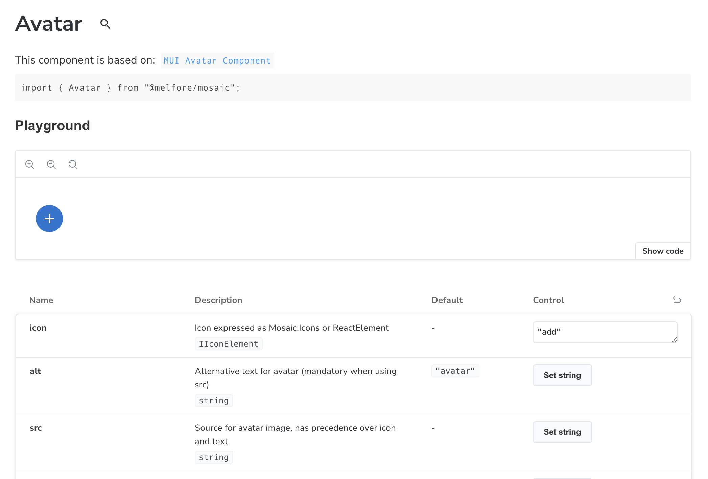
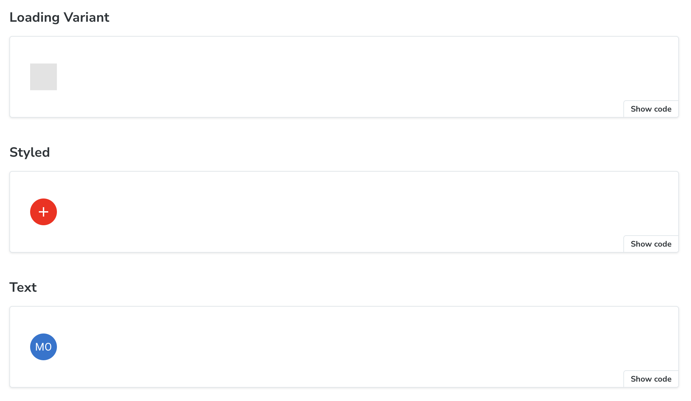

# @melfore/mosaic

  [](https://github.com/melfore/mosaic/actions/workflows/release-beta.yml)  [](http://commitizen.github.io/cz-cli/)

Melfore's UI kit library based on `@mui/*`.

 <a href="https://github.com/melfore/mosaic/blob/main/CHANGELOG.md" target="_blank">**Changelog**</a> | <a href="https://github.com/melfore/mosaic/blob/main/CONTRIBUTING.md" target="_blank">**Contributing**</a> | <a href="https://github.com/melfore/mosaic/blob/main/MIGRATION.md" target="_blank">**Migration**</a> | <a href="https://melfore.github.io/mosaic/latest/" target="_blank">**Storybook**</a>

## Getting started

Starting from @melfore/mosaic v8.x Mosaic dropped support for React < v18.x and Material UI < v5.x

Add the package to your project with:

`npm install @melfore/mosaic`

It requires these `peerDependencies` to be installed in host project:

```
    "@emotion/react": ">= 11.8.2 < 12",
    "@emotion/styled": ">= 11.8.1 < 12",
    "@mui/icons-material": ">= 5.5.1 < 6",
    "@mui/material": ">= 5.5.3 < 6",
    "@mui/system": ">= 5.15.4 < 6",
    "@mui/x-date-pickers": ">= 6.16.0 < 7",
    "luxon": ">= 3.4.4 < 4",
    "react": ">= 18 < 19",
    "react-dom": ">= 18 < 19",
    "react-window": ">= 1.8.0 < 1.9.0"
```

## Usage

Browse our <a href="https://melfore.github.io/mosaic/latest/" target="_blank">StoryBook</a> to discover all available components.

Each component has a dedicated docs page showing how to import plus a playground with a table listing all props that can be dynamically changed to see the results in real time.



Below the props table you can find a list of most common usage scenario. These are ready to use samples that can be copied and pasted into your codebase using the **Show code** option.



Browse <a href="https://melfore.github.io/mosaic/latest/" target="_blank">StoryBook</a> to discover all available components.
